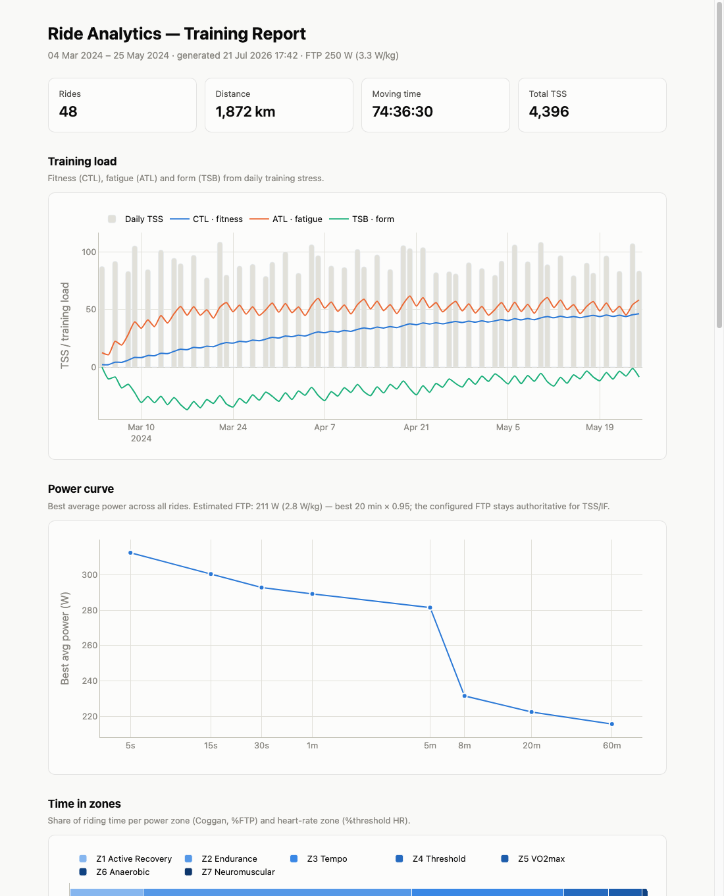
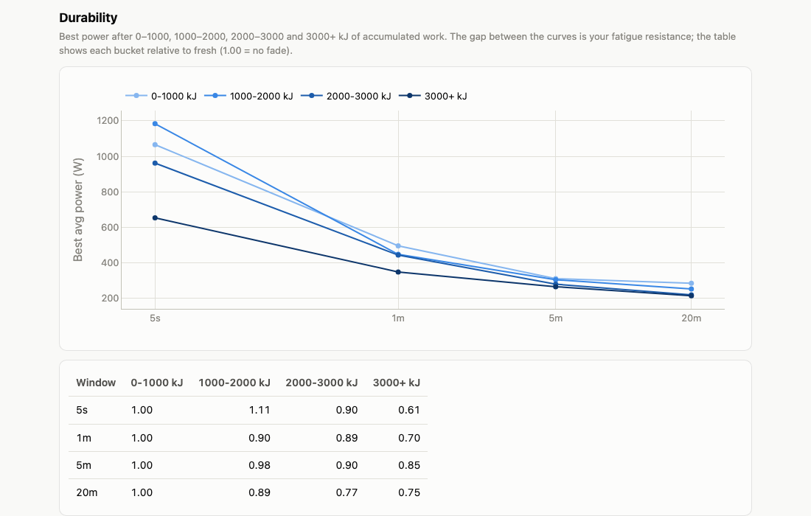

# Ride Analytics

A Python CLI that turns a Strava/Garmin FIT export into one self-contained HTML training report: normalized power, training load (CTL/ATL/TSB), power curve, and time in zones, computed entirely on your machine.



*Report rendered from synthetic demo data.*

## Why local, why no API

Strava tightened its API terms in 2026: API data may not be fed into AI models, and third-party apps may no longer display other users' data. Instead of building on an API that restricts what you can do with your own numbers, this tool reads the FIT files from a regular Strava bulk export. Everything runs offline. No OAuth, no tokens, no server, and your training data never leaves your disk.

## Features

- Reads a single FIT file or a whole export folder; skips non-cycling activities with a log note
- Tolerates missing sensors: rides without power still get distance, time, HR stats and an HR-based TSS estimate
- Single-ride metrics: Normalized Power, Intensity Factor, TSS, Variability Index, work in kJ, moving vs. elapsed time
- Mean-maximal power curve (5 s to 60 min) per ride and across the whole history, with an FTP estimate from the best 20-min effort
- Performance Management Chart: CTL, ATL and TSB as a day-continuous series
- Time in Coggan power zones (7) and heart-rate zones (5)
- Durability analysis: power curves split by accumulated work (0–1000 / 1000–2000 / 2000–3000 / 3000+ kJ) with a durability index per window — how much power you lose once fatigue sets in
- Automatic climb detection from elevation data, no Strava segments needed: length, gain, gradients, VAM, W/kg, pacing quarters, and matching of repeated climbs with personal bests
- Period comparison (`compare`): any two date ranges or `--preset last-two-seasons`, with per-week normalization when the periods differ in length
- CSV export of every computed metric (`--export-csv`) for further analysis in Excel/Sheets
- One self-contained HTML report with interactive Plotly charts (works without internet), plus an optional terminal summary

## Install

Requires Python 3.11+.

```bash
git clone https://github.com/BeFuchs/strava-analytics.git
cd strava-analytics
python3 -m venv .venv && source .venv/bin/activate
pip install -e .
```

## Quickstart

1. **Get your FIT files.** Strava: *Settings → My Account → Download or Delete Your Account → Request your archive*. The ZIP contains an `activities/` folder with your original FIT files. Garmin devices store FIT files directly on the device (`GARMIN/Activity/`).
2. **Set your athlete profile.** Copy `config.example.yaml` to `config.yaml` and enter your FTP, threshold heart rate, weight and max HR. TSS and zone boundaries depend on these values.
3. **Run the analysis:**

```bash
ride-analytics analyze path/to/activities --report report.html --summary --export-csv csv/
```

`analyze` accepts a single `.fit` file or a folder. `--summary` prints a per-ride table to the terminal, `--export-csv` writes all metrics as CSV files; the HTML report is written either way.

To compare two seasons or arbitrary date ranges:

```bash
ride-analytics compare path/to/activities --preset last-two-seasons --report compare.html
ride-analytics compare path/to/activities --period-a 2025-01-01:2025-06-30 --period-b 2026-01-01:2026-06-30
```

## The numbers, briefly

**Normalized Power (NP)** weights power spikes the way your body feels them: a 30-second rolling average is raised to the fourth power, averaged, and rooted again. A ride with surges gets a higher NP than its plain average, which is why NP is the better basis for training stress.

**Intensity Factor (IF)** is NP divided by your FTP. An IF of 1.0 means you rode at threshold for the whole ride; 0.7 is a typical endurance ride.

**Training Stress Score (TSS)** combines duration and intensity into one load number. One hour at FTP equals 100 TSS. Rides without power get an estimate from heart rate relative to your threshold HR, marked as estimated in the report.

**CTL (Chronic Training Load)** is a 42-day weighted average of daily TSS, a proxy for fitness. It rises slowly when you train consistently and decays slowly when you stop.

**ATL (Acute Training Load)** is the same average over 7 days, a proxy for fatigue. It reacts fast in both directions.

**TSB (Training Stress Balance)** is yesterday's CTL minus yesterday's ATL, a proxy for form. Negative values mean you are carrying fatigue; positive values mean you are fresh, at the cost of losing fitness if it stays positive too long.

**Variability Index (VI)** is NP divided by average power. A steady time trial sits near 1.0; a criterium or group ride sits well above.

**Durability** is how much power you still produce after work has piled up. Each ride is split by accumulated work into kJ buckets, and the best efforts are computed inside each bucket separately, so your fresh 20-min best and your 20-min best after 2,000 kJ become two different numbers. The durability index compares each bucket to the fresh one: 0.85 means 15 % of your power is gone at that depth of fatigue — a dimension Strava doesn't show at all.



*Durability section of the report: one power curve per kJ bucket; the gap between the curves is fatigue resistance.*

**VAM (Vertical Ascent Metres per hour)** is climbing speed measured vertically: elevation gain divided by climbing time. It makes climbs of different length and gradient directly comparable — a steady club rider climbs at 700–900 m/h, pro race pace on a mountain pass is 1,500+.

## Troubleshooting

**`ModuleNotFoundError: No module named 'ride_analytics'` after `pip install -e .`**

This happens when `.venv` lives inside a cloud-synced folder (iCloud Drive's
Desktop & Documents sync, Dropbox, OneDrive, Google Drive). These services
often fail to sync the Python symlinks inside `.venv/bin` correctly, leaving
a broken virtual environment even though installation reports no errors.

Fix — recreate the virtual environment:

```bash
rm -rf .venv
python3 -m venv .venv
source .venv/bin/activate
pip install -e .
```

To avoid this permanently, keep the project outside any cloud-synced directory.

## Climb detection

Climbs are detected from the smoothed barometric altitude alone — no Strava segments needed. A stretch counts as a climb when it averages **at least 3 % gradient, gains at least 30 m and runs at least 500 m**. These thresholds are deliberate: 3 % is where climbing starts to dominate the power demand, 30 m filters out highway ramps and railway bridges, and 500 m keeps every short kicker from flooding the list. Short flat or downhill pieces inside a climb (under 200 m or 30 s) don't end it — a hairpin road with flat corners is one climb, not twenty. Repeated climbs are matched by start location (haversine) and similar length and gain, which yields personal bests and a time trend per climb.

## Architecture

```
src/ride_analytics/
├── cli.py              # click entry point, wiring only
├── config.py           # YAML athlete profile -> typed AthleteConfig
├── ingest.py           # FIT files -> normalized per-ride DataFrames
├── metrics/
│   ├── single_ride.py  # NP, IF, TSS, VI, kJ, moving/elapsed time
│   ├── power_curve.py  # mean-maximal power + FTP estimate
│   ├── durability.py   # power curves per kJ bucket + durability index
│   ├── climbs.py       # climb detection, VAM, repeated-climb matching
│   ├── comparison.py   # two-period aggregation and deltas
│   ├── pmc.py          # CTL / ATL / TSB time series
│   └── zones.py        # power & HR zone distributions
├── export/
│   └── csv_export.py   # all computed metrics as CSV files
└── report/
    ├── builder.py      # data model + Plotly figures + template rendering
    └── templates/      # self-contained HTML report
```

Each metric is a pure function `(DataFrame, AthleteConfig) -> result`: ingest knows nothing about metrics, metrics know nothing about HTML, the report layer does no math. The test suite verifies every formula against synthetic data with known results (constant 200 W for an hour at FTP 200 must yield IF 1.0 and TSS 100) and feeds the ingest layer with FIT files generated by a minimal binary encoder in `tests/conftest.py`.

```bash
pip install -e ".[dev]"
pytest && ruff check
```

## Future work

- Training plan suggestions derived from the PMC
- Multi-sport support beyond cycling
- W' balance and other advanced power models
- Route map rendering (would need external map tiles; the elevation profile stays the default)

## About

A personal learning project, in active development, built to learn Python properly on a problem I care about as a cyclist. Not affiliated with Strava or Garmin. MIT licensed.
